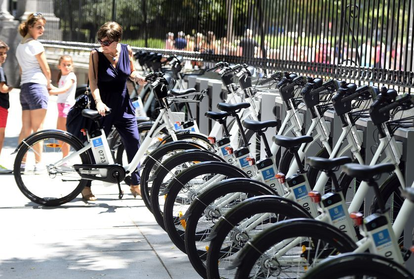

<h2 align="center">Cyclistic Bike Share Analysis Case Study</h1>

  

## Introduction

This is a capstone case study from the Google Data Analitics professional certicate. For this case study, I had the option of choosingan analytics-based scenario.
I had the opportunity to apply the six data analysis phases: ask, prepare, process, analyze, share and act. 

## Scenario
I am a junior data analyst working in the marketing analyst team at Cyclistic, a bike-share company in Chicago. The director of marketing believes the company’s future success depends on maximizing the number of annual memberships. Therefore, my team wants to understand how casual riders and annual members use Cyclistic bikes differently. From these insights, my team will design a new marketing strategy to convert casual riders into annyal memeber. But first, Cyclistic executives must approve of my recommendations, so they must be backed up with compelling data instights and professional data visualizations.

## Goal
The marketing director has set a clear goal: Design marketing strategies aimed at converting casual riders into annual members.
